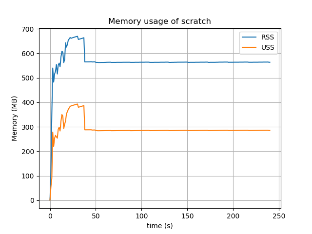
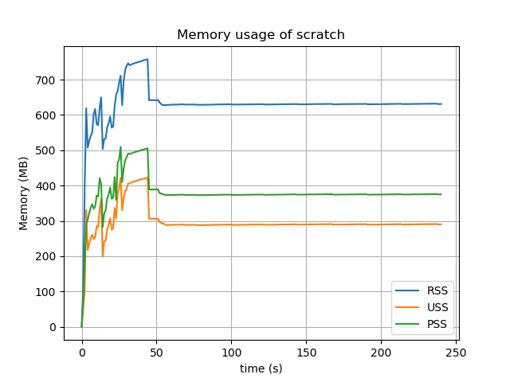
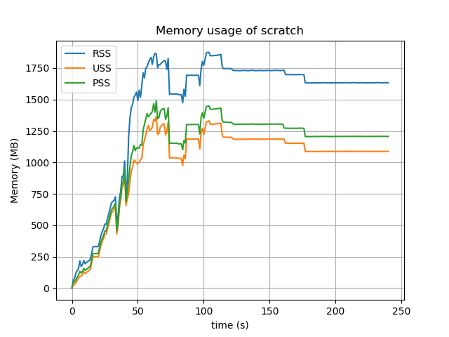
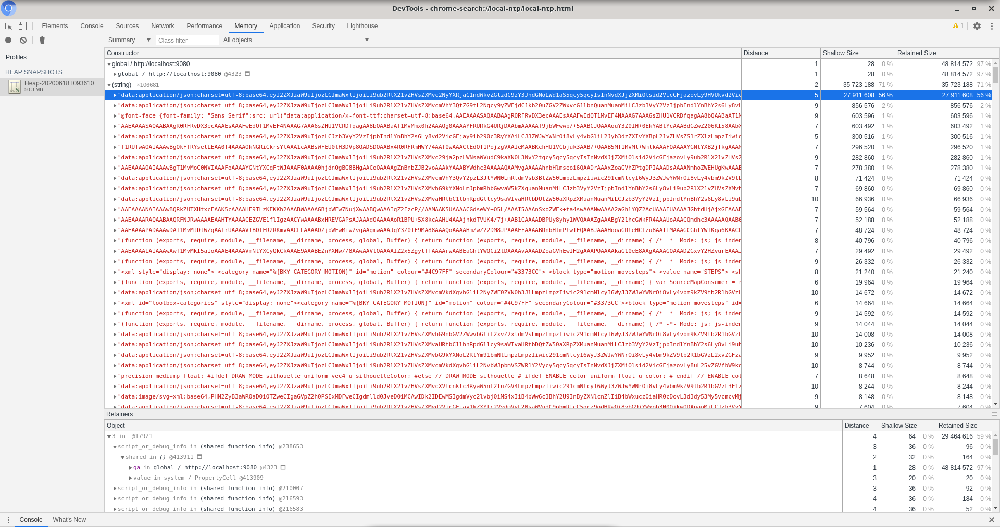
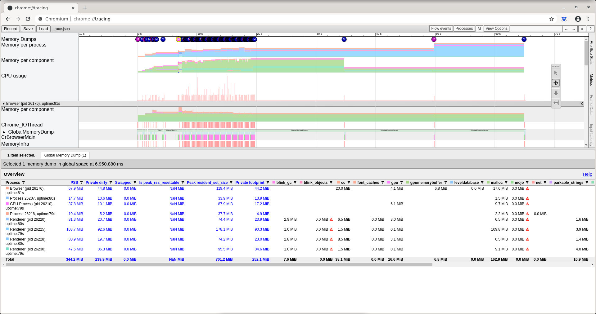
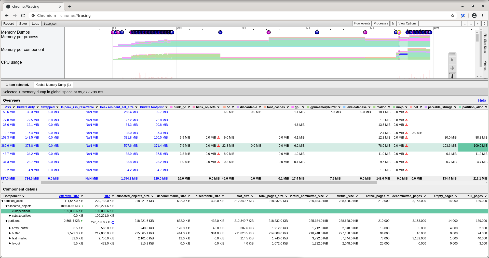
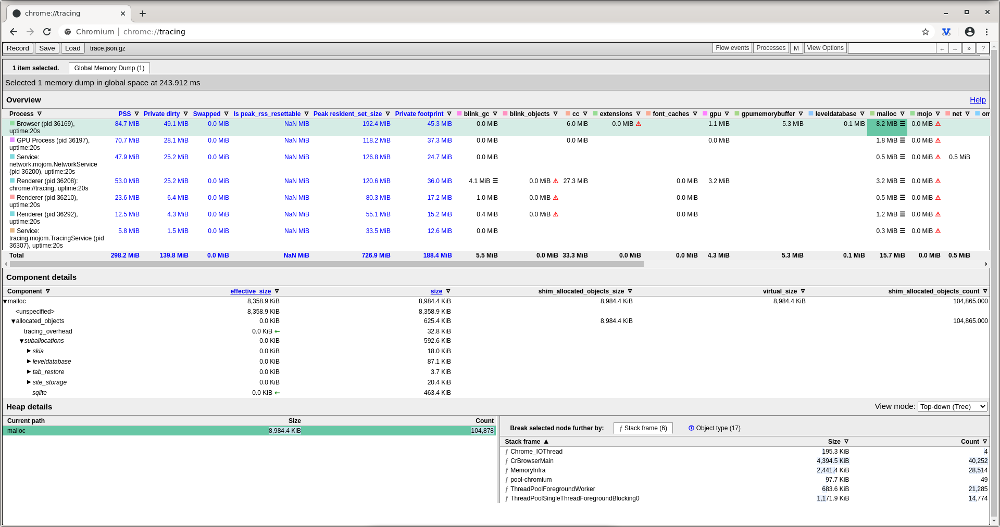

# scratch-profiling

Scripts for profiling scratch memory usage etc.

Makes use of python + psutil to obtain memory usage recursively for a particular spawned process.

# Usage

To examine memory usage:

```
sudo apt install python3-matplotlib
./memory.py --cmd scratch3 --out graph.png
```

To examine files from the ASAR:

```
npx asar extract app.asar unpacked
./asar_investigate.py --in unpacked/1.bundle.js
```

# Examples

I believe now that PSS gives a more accurate measure of memory utilised when summed for child processes than RSS, as 
I ran 'free -m' while Scratch (new version) was running and after, and the difference of free memory was around 370MB, which is much closer to the PSS value, around 375MB.

The link - https://stackoverflow.com/questions/131303/how-to-measure-actual-memory-usage-of-an-application-or-process has some good information on RSS, USS and PSS.

## Scratch3 Raspbian Version




## Scratch3 New Version



## Scratch3 New Version with devtools



# Base64

I found the running Scratch processes doing:

```
ps ax | grep "[s]cratch" | awk '{ print $1 }' | tr '\n' ' '
```

Using the PIDs obtained through the previous step, I then did the following to create core dumps for each process, and output strings from them:

```
gcore -o dump.bin 4899 4902 4904 4930 4935 4937 4939 4970 5021
strings dump.bin.*
```

I noticed in the dumps there appeared to be some Base64, which existed in the app.asar file, confirmed by:
```
grep "<BASE64 String>" app.asar
```

I need to determine if this Base64 data was actually in the RAM itself, or was a memory mapped file.

I am currently looking at the section "Controlling which mappings are written to the core dump" in https://man7.org/linux/man-pages/man5/core.5.html

It says "By default, the following bits are set: 0, 1, 4", which would mean file backed storage wouldn't be written with the core dump.

It seems using 'gcore -a' ignores these filter bits and captures all data, so I removed using the '-a' argument.

I checked the value:

```
cat /proc/4899/coredump_filter 
00000033
```

Which is 00110011 in binary, which should mean file-backed mappings weren't included.

# Heap profile

Base64 strings are visible in the heap profile:



You can see the selected base64 string occupies 26.6MB, which matches the size of one of the base64
strings from the .asar file (in the file 1.bundle.js, contained within the .asar), found using the 
asar_investigate.py script.

The total size for the heap dump for index.html appears to be roughly 60MB and the heap dump for about.html
seems to be 5MB.  While the sum total memory is roughly 370MB as measured by summing PSS memory
values for all Scratch processes.

# gperftools

I tried using gperftools - https://github.com/gperftools/gperftools

To see if I could find any memory leaks doing:

```
HEAPCHECK=normal HEAPPROFILE=/tmp/heap.hprof DISPLAY=:0.0 LD_PRELOAD=./libtcmalloc.so scratch3 
```

Unfortunately that failed to work, giving:

```
No live heap object at 0x571fe40 to ignore
Check failed: heap_profile->FindAlloc(test_str, &size): our own new/delete not linked?
```

# LD_PRELOAD

I also tried hooking malloc, using LD_PRELOAD, running scratch like:

```
gcc -Wall -fPIC -shared -o mem.so mem.c -ldl
LD_PRELOAD=./mem.so scratch3
```

This was to see if I could monitor large memory allocations.  However I only obtained very small allocations, I assume V8 might use a different allocator for the majority of allocations?.

```
#define _GNU_SOURCE
#include <stdio.h>
#include <dlfcn.h>

void * malloc(size_t size) {
    void *(*original_malloc)(size_t size);
    original_malloc = dlsym(RTLD_NEXT, "malloc");

    fprintf(stderr,"malloc %d\n",size);
    fflush(stderr);
    
    return original_malloc(size);
}
```

# Valgrind

Valgrind is a very handy tool for investigating memory leaks etc, however it seems it currently 
can't be used with electron:

https://github.com/electron/electron/issues/11769

(I did try it though, but Scratch didn't open)

# Tracing

The following excellent webpage describes how to trace all processes of electron during startup:
https://blog.scottlogic.com/2019/05/21/analysing-electron-performance-chromium-tracing.html

In scratch-desktop, to the package.json I modified the "start" line to:
```
    "start": "electron-webpack dev --bail --display-error-details --env.minify=false --trace-config-file=./trace-config.json",
```

And created trace-config.json:

```
{  
  "startup_duration": 80,
  "result_file": "./trace.json",
  "trace_config": {
    "included_categories": ["disabled-by-default-memory-infra"],
    "excluded_categories": ["*"], 
    "memory_dump_config": {
      "triggers": [
        { "mode": "light", "periodic_interval_ms": 50 },
        { "mode": "detailed", "periodic_interval_ms": 1000 }
      ]
    }
  }
}
```

I found you need to open the JSON created in "chrome://tracing/" rather than devtools.



I found that unfortunately the list of objects that are allocated seem to be 'unspecified' sometimes:



I tried enabling 'memlog', to get additional heap information:

In scratch-desktop/src/main/index.js:

Near the top I added:

```
app.commandLine.appendSwitch("memlog","all")
app.commandLine.appendSwitch("memlog-sampling")
app.commandLine.appendSwitch("memlog-keep-small-allocations")
app.commandLine.appendSwitch("memlog-sampling-rate",100000)
app.commandLine.appendSwitch('memlog-stack-mode', 'native');
```

At the bottom of the 'app.on('ready', () => {' method, I added:
```
    (async () => {
    await contentTracing.startRecording({
      trace_buffer_size_in_kb: 1024*300,
      included_categories: ['disabled-by-default-memory-infra'],
      excluded_categories: ['*'],
      "memory_dump_config": {
      "triggers": [
        { "mode": "light", "periodic_interval_ms": 50 },
        { "mode": "detailed", "periodic_interval_ms": 1000 }
      ]
     }
    })
    console.log('Tracing started')
    await new Promise(resolve => setTimeout(resolve, 60000))
    const path = await contentTracing.stopRecording()
    console.log('Tracing data recorded to ' + path)
  })()
```

This did create a trace file, however there was still no additional heap information.

In Chromium if I create a trace via chrome://tracing, just for the Chromium browser (not related to electron)
and enable MemoryInfra and set the memlog flags a heap section does appear, so it's strange that I am not obtaining 
one with electron too:




# To Do

* Investigate ASAR contents
* Profile memory usage
