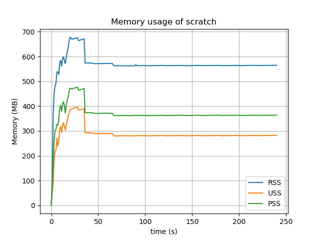

# scratch-profiling

Scripts for profiling scratch memory usage etc.

Makes use of python + psutil to obtain memory usage recursively for a particular spawned process.

# Usage

```
sudo apt install python3-matplotlib
./memory.py --cmd scratch3 --out graph.png
```

# Examples

I believe now that USS gives a more accurate measure of memory utilised when summed for child processes than RSS, as 
I ran 'free -m' while Scratch was running and after, and the difference was around 350MB, which is much closer to the USS value.

## Scratch3 Raspbian Version




## Scratch3 New Version


# To Do

* Profile memory usage
